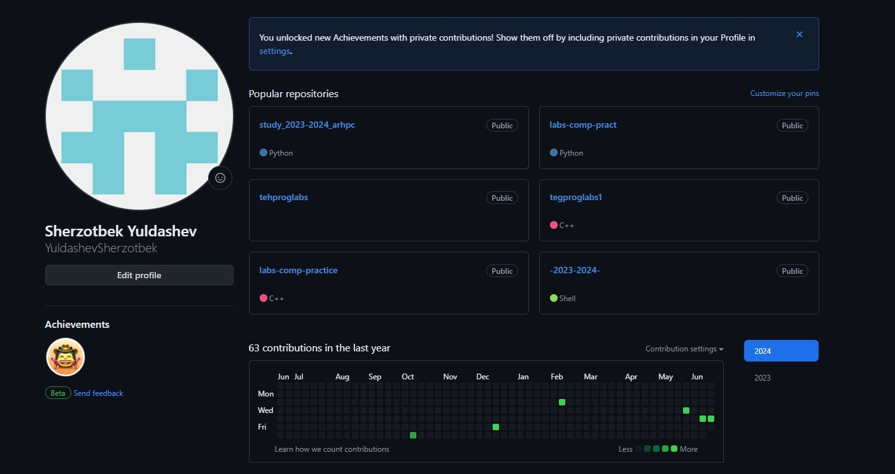
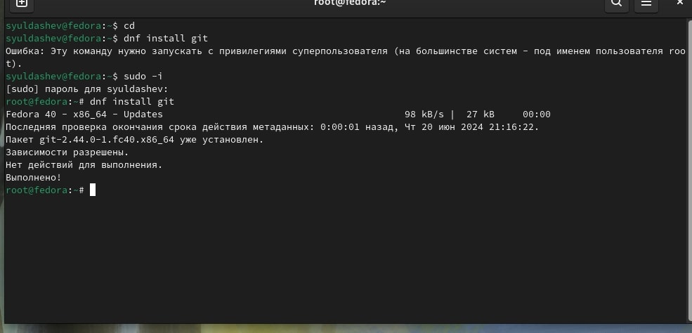
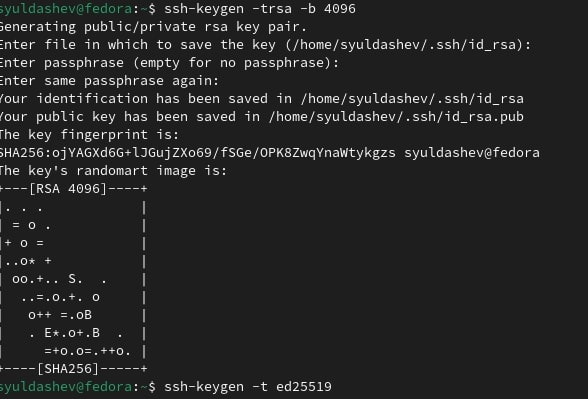
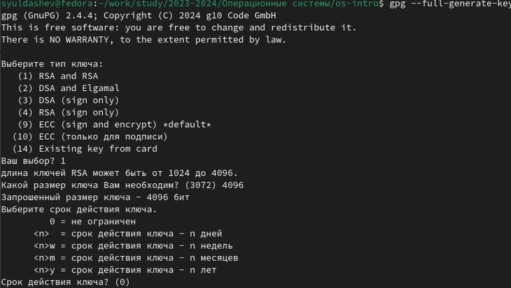
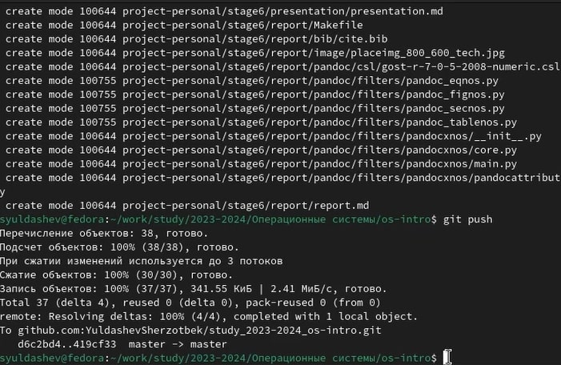

---
## Front matter
title: "Лабораторная 02"
subtitle: "Отчет"
author: "Юлдашев Шерзотбек"

## Generic otions
lang: ru-RU
toc-title: "Содержание"

## Bibliography
bibliography: bib/cite.bib
csl: pandoc/csl/gost-r-7-0-5-2008-numeric.csl

## Pdf output format
toc: true # Table of contents
toc-depth: 2
lof: true # List of figures
lot: true # List of tables
fontsize: 12pt
linestretch: 1.5
papersize: a4
documentclass: scrreprt
## I18n polyglossia
polyglossia-lang:
  name: russian
  options:
	- spelling=modern
	- babelshorthands=true
polyglossia-otherlangs:
  name: english
## I18n babel
babel-lang: russian
babel-otherlangs: english
## Fonts
mainfont: PT Serif
romanfont: PT Serif
sansfont: PT Sans
monofont: PT Mono
mainfontoptions: Ligatures=TeX
romanfontoptions: Ligatures=TeX
sansfontoptions: Ligatures=TeX,Scale=MatchLowercase
monofontoptions: Scale=MatchLowercase,Scale=0.9
## Biblatex
biblatex: true
biblio-style: "gost-numeric"
biblatexoptions:
  - parentracker=true
  - backend=biber
  - hyperref=auto
  - language=auto
  - autolang=other*
  - citestyle=gost-numeric
## Pandoc-crossref LaTeX customization
figureTitle: "Рис."
tableTitle: "Таблица"
listingTitle: "Листинг"
lofTitle: "Список иллюстраций"
lotTitle: "Список таблиц"
lolTitle: "Листинги"
## Misc options
indent: true
header-includes:
  - \usepackage{indentfirst}
  - \usepackage{float} # keep figures where there are in the text
  - \floatplacement{figure}{H} # keep figures where there are in the text
---

# Цель работы

Изучить идеологию и применение средств контроля версий
Освоить умения по работе с git

# Задание

Создать базовую кофигурацию для работы с git
Создать ключ SSH
Создать ключ PSP
Настроить надписи git
Зарегистрироваться на Github
Создать локальный каталог для выполнения заданий по предмету

# Выполнение лабораторной работы

## Настройка Github. Создание учетной записи на github(рис. 001]).

001

## Установка git, gh. (рис. 002]).

## Установка gh в Linux (рис. 003]).

## Базовая настройка git (рис. [004]).

## Создание ключа SSH (рис. 009).010]).

## Создание ключа PGP (рис. 005]).

## Добавление ключа PGP в Github (рис. 008]). (рис. 010]).

## Настройка gh (рис. 011]).

## Создание репозитория на основне шаблона (рис. 013]).

### Перейти в каталог курса и удалить лишние файлы (рис. 015]).

### Создать необходимые каталоги (рис. 016]).

### Отправлю файлы на сервер (рис. 017]).

## Мой репозиторий (рис. 018]).

# Выводы

Я научился работать с github и создавать в github каталоги и репозитории, освоил основные умения по работе с git

