---
## Front matter
title: "Лабораторная 02"
subtitle: "Отчет"
author: "Юлдашев Шерзотбек"

## Generic otions
lang: ru-RU
toc-title: "Содержание"

## Bibliography
bibliography: bib/cite.bib
csl: pandoc/csl/gost-r-7-0-5-2008-numeric.csl

## Pdf output format
toc: true # Table of contents
toc-depth: 2
lof: true # List of figures
lot: true # List of tables
fontsize: 12pt
linestretch: 1.5
papersize: a4
documentclass: scrreprt
## I18n polyglossia
polyglossia-lang:
  name: russian
  options:
	- spelling=modern
	- babelshorthands=true
polyglossia-otherlangs:
  name: english
## I18n babel
babel-lang: russian
babel-otherlangs: english
## Fonts
mainfont: PT Serif
romanfont: PT Serif
sansfont: PT Sans
monofont: PT Mono
mainfontoptions: Ligatures=TeX
romanfontoptions: Ligatures=TeX
sansfontoptions: Ligatures=TeX,Scale=MatchLowercase
monofontoptions: Scale=MatchLowercase,Scale=0.9
## Biblatex
biblatex: true
biblio-style: "gost-numeric"
biblatexoptions:
  - parentracker=true
  - backend=biber
  - hyperref=auto
  - language=auto
  - autolang=other*
  - citestyle=gost-numeric
## Pandoc-crossref LaTeX customization
figureTitle: "Рис."
tableTitle: "Таблица"
listingTitle: "Листинг"
lofTitle: "Список иллюстраций"
lotTitle: "Список таблиц"
lolTitle: "Листинги"
## Misc options
indent: true
header-includes:
  - \usepackage{indentfirst}
  - \usepackage{float} # keep figures where there are in the text
  - \floatplacement{figure}{H} # keep figures where there are in the text
---

# Цель работы

Изучить идеологию и применение средств контроля версий
Освоить умения по работе с git

# Задание

Создать базовую кофигурацию для работы с git
Создать ключ SSH
Создать ключ PSP
Настроить надписи git
Зарегистрироваться на Github
Создать локальный каталог для выполнения заданий по предмету

# Выполнение лабораторной работы

Описываются проведённые действия, в качестве иллюстрации даётся ссылка на иллюстрацию (рис. [-@fig:001]).

## Настройка Github. Создание учетной записи на github(рис. [-@fig:001]).

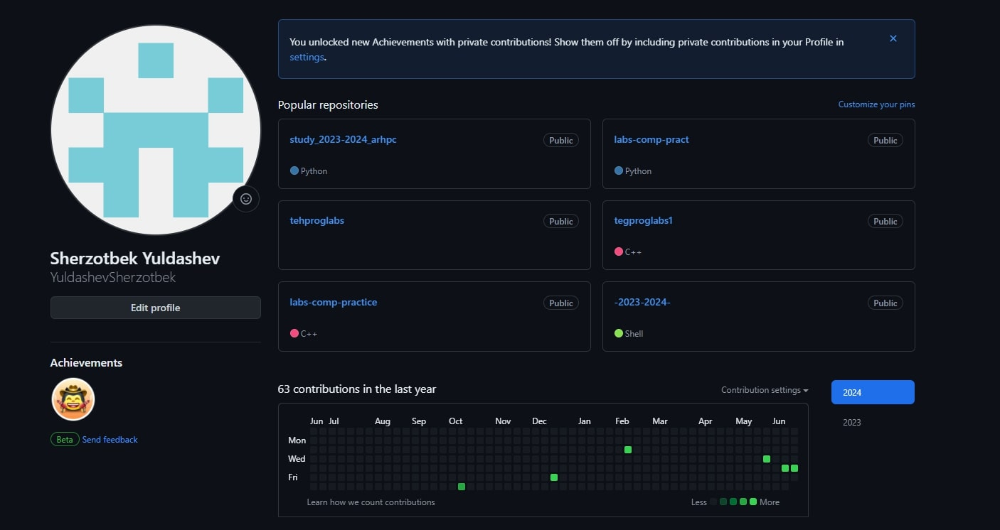{#fig:001 width=70%}

## Установка git, gh. (рис. [-@fig:002]).

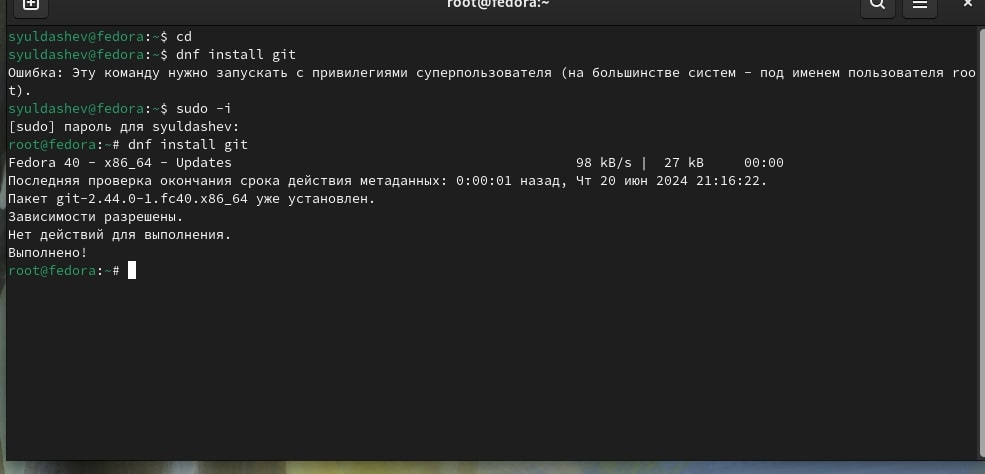{#fig:002 width=70%}

## Установка gh в Linux (рис. [-@fig:003]).

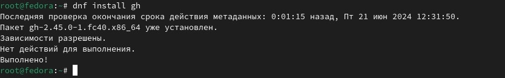{#fig:003 width=70%}

## Базовая настройка git (рис. [-@fig:004]).

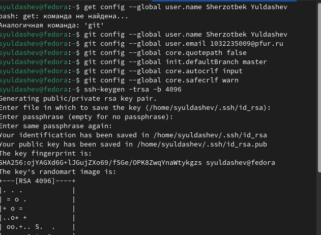{#fig:004 width=70%}

## Создание ключа SSH (рис. [-@fig:009]).[-@fig:010]).

{#fig:009 width=70%}

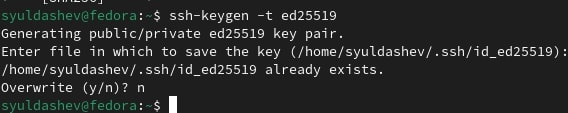{#fig:010 width=70%}

## Создание ключа PGP (рис. [-@fig:005]).

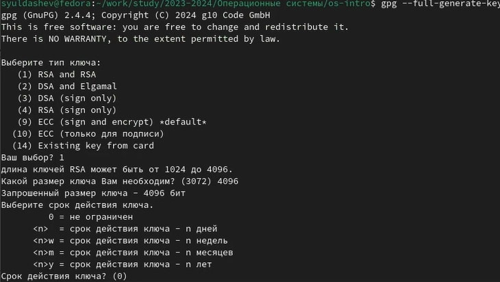{#fig:005 width=70%}

## Добавление ключа PGP в Github (рис. [-@fig:008]).

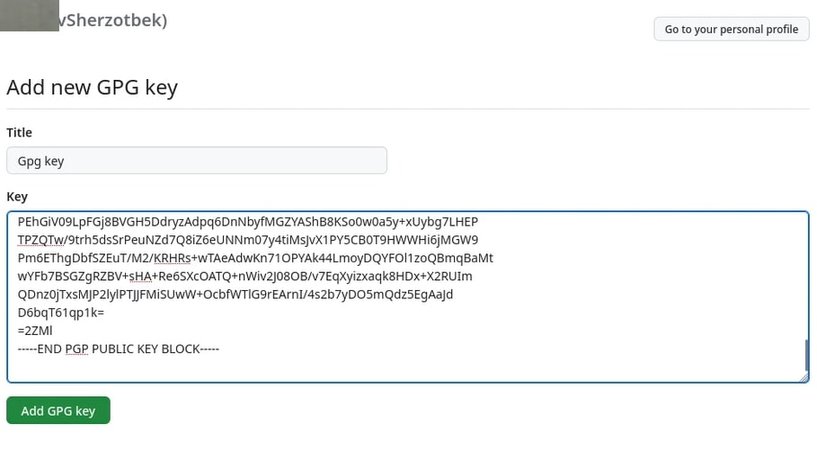{#fig:008 width=70%}

{#fig:010 width=70%}

## Настройка gh (рис. [-@fig:011]).

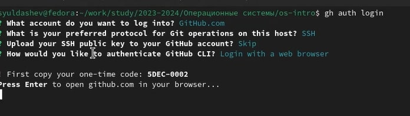{#fig:011 width=70%}

## Создание репозитория на основне шаблона (рис. [-@fig:001]).

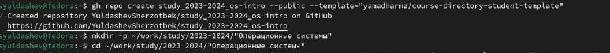{#fig:013 width=70%}

### Настройка каталога курса (рис. [-@fig:001]).

### Перейти в каталог курса и удалить лишние файлы (рис. [-@fig:001]).

{#fig:015 width=70%}

### Создать необходимые каталоги (рис. [-@fig:001]).

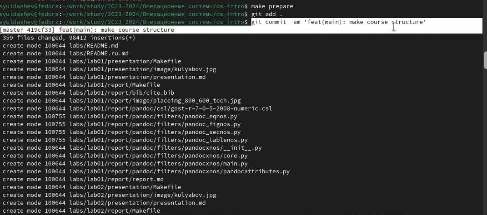{#fig:016 width=70%}

### Отправлю файлы на сервер (рис. [-@fig:001]).

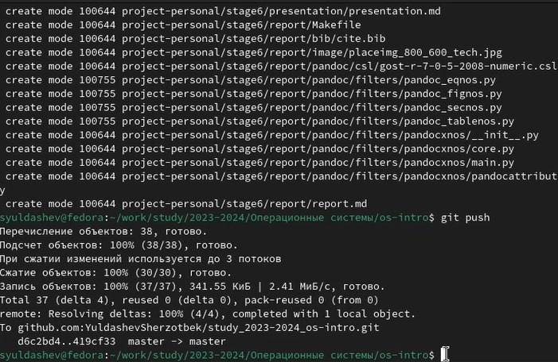{#fig:017 width=70%}

## Мой репозиторий (рис. [-@fig:018]).

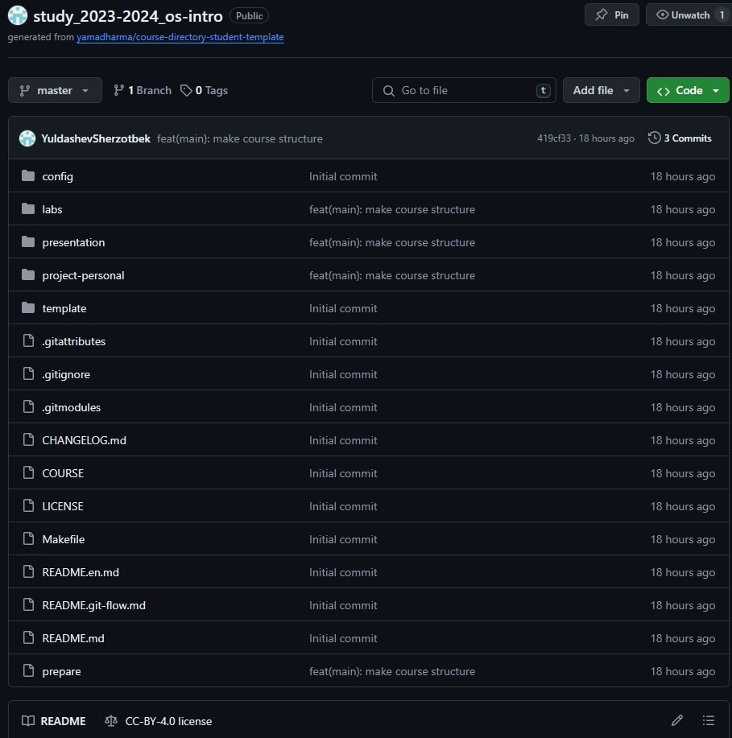{#fig:018 width=70%}

# Выводы

Я научился работать с github и создавать в github каталоги и репозитории, освоил основные умения по работе с git

